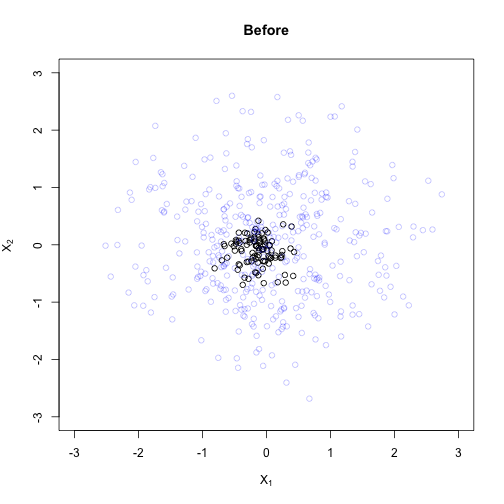
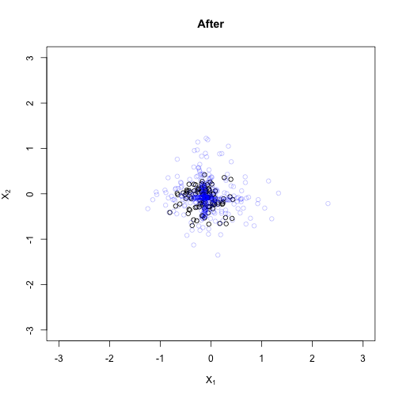

## Overview
For most users, the vanilla function `calc_weight` should be sufficient for most use cases with binary treatments. However, for users with more complicated data structures or problems, the `causalOT` package offers a more flexible interface heavily reliant on the `torch` package. We will walk through a few use cases here to show how one might use the object-oriented programming (OOP) objects. 

One **very** important thing to note is that these objects are mutable; in other words, they are always passed by reference so changes to the base objects will effect all other objects they are reliant on. Thus, changes will propagate forward and backward. For these reasons, these objects will be more dangerous in terms of side-effects and should be used carefully.

Finally, these data structures are heavy reliant on the ``torch`` package in ``R``. This allows relatively easy use of GPUs and also has other advantages such as passing by reference and various optimization methods available by default.


## Base functions for OOP

### Measure objects

The fundamental objects underlying the OOP software methods in the package is an `R6` class `Measure`. These objects are named for the fact that they specify an empirical distribution on a set of support points. In light of this, the first two arguments should be intuitive: `x`, the set of data for the measure, and `weights`, the empirical mass.


```r
n <- 5
d <- 3
x <- matrix(stats::rnorm(n*d), nrow = n)
w <- stats::runif(n)
w <- w/sum(w)

m <- Measure(x = x, weights = w)
```
We can also view the weights and data of a measure object by accessing these public fields:

```r
 m$x
#> torch_tensor
#> -0.1088  0.1408 -0.9207
#>  0.0217 -1.5297 -0.2621
#>  1.0911  0.1324 -0.2298
#> -0.0686  0.5114 -0.0258
#>  0.7843  1.1124 -1.3936
#> [ CPUDoubleType{5,3} ]
 m$weights
#> torch_tensor
#>  0.2228
#>  0.1881
#>  0.2386
#>  0.2295
#>  0.1211
#> [ CPUDoubleType{5} ]
```
The next argument in the constructor function, `probability.measure`, lets the function know if your weights are a probability measure---i.e., the weights sum to 1 and are positive---versus a more general type of measure. The default assumption is that you are using a probability measure.

Then we come to a very important argument: `adapt`. This let's the function know if you are seeking to change nothing ("none") and keep the measure static, if you want to adapt the weights ("weights") towards another measure, or if you want to move the data points of the measure itself ("x"). 


```r
m <- Measure(x = x, weights = w, 
             probability.measure = TRUE,
             adapt = "none")
```

**Adapting the measure to functions of target data.** 
The next two arguments are useful in the setting when you want to adapt specific functions of the `Measure` to target data. Typically, these target functions will be the empirical means of some aspect of the covariates in a target data set. As an example:

```r
target.data <- matrix(rnorm(n*d),n,d)
target.values <- colMeans(target.data)

m <- Measure(x = x, weights = w, 
             probability.measure = TRUE,
             adapt = "weights",
             target.values = target.values)
```
Note that if we don't supply the `balance.functions` argument and `target.values` are provided, the function will use the data in `x` as the `balance.functions`. We can view are balance functions with the following arguments:

```r
m$balance_functions # to view the balance functions
m$balance_target # to view the target values
```
Note that the values returned  are different than the original. This is because the software divides the balance functions and target values by the standard deviation of the balance function.

```r
all.equal(as.numeric(m$balance_target), target.values)
#> [1] "Mean relative difference: 0.396385"
all.equal(as.matrix(m$balance_functions), x)
#> [1] "Mean relative difference: 0.3160986"

sds <- apply(x,2,sd)
all.equal(as.numeric(m$balance_target), target.values/sds)
#> [1] TRUE
all.equal(as.matrix(m$balance_functions), sweep(x,2,sds,"/"))
#> [1] TRUE
```
Obviously, if `adapt = "none"`, then the `balance.functions` and `target.values` are essentially useless. 

Finally, the arguments `dtype` and  `device` are arguments for setting of the the `torch_tensor`s of the underlying data structures. For more information, see the `torch` [documentation](https://torch.mlverse.org/docs/index.html).

<!-- We should also note that the underlying data structures are changed to `torch_tensor`s as provided by the [`torch`](https://github.com/mlverse/torch) package. This means that if you pass a `torch_tensor` initially, it will not be copied. Be careful as this can lead to side effects down the road: -->
<!-- ``` {r} -->
<!-- x_tensor <- torch::torch_tensor(x) -->
<!-- w_tensor <- torch::torch_tensor(w) -->
<!-- m_tensor <- Measure(x = x_tensor, weights = w_tensor) -->
<!-- all.equal(rlang::obj_address(x_tensor), rlang::obj_address(m_tensor$x)) -->
<!-- all.equal(rlang::obj_address(m_tensor$weights), -->
<!--           rlang::obj_address(w_tensor)) -->

<!-- x_tensor[1,1] -->
<!-- x_tensor[1,1] <- Inf -->
<!-- m_tensor$x[1,1] -->
<!-- ``` -->


Also, we can print the measure objects to the screen to see some of the underlying information quickly. We also get the object address which can be useful in distinguishing the different objects.

```r
m
#> Measure: 0x7fdd8b7c4eb8
#>   x      : a 5x3 matrix 
#>            -0.11, 0.14, -0.92
#>            0.02, -1.53, -0.26
#>            1.09, 0.13, -0.23
#>            -0.07, 0.51, -0.03
#>            0.78, 1.11, -1.39
#>   weights: 0.22, 0.19, 0.24, 0.23, 0.12
#>   balance: 
#>    funct.: -0.2, 0.14, -1.61
#>    target: 0.55, -0.2, -1.53 …
#>   adapt  : weights
#>   dtype  : torch_Double
#>   device : torch_device(type='cpu')
```


### OTProblem objects
The next important component of the OOP framework in `causalOT` are the `OTProblem` objects. Say we have to measures, one we want to target, `m_target`, and one we want to adapt to the target measure, `m_source` by changing its weights.

```r
m_target <- Measure(x = matrix(rnorm(n*2*d), n*2,d))
m_source <- Measure(x = x, weights = w, adapt = "weights")
```

Now we need some way of adapting `m_source` and in this package, we will use optimal transport methods. Thus, we specify our optimal transport problem:

```r
otp <- OTProblem(m_source, m_target)
```
The `OTProblem` is the basis for setting up the following objective function
\[
\begin{align*}
w^\star &= \operatorname{argmin}_w OT_\lambda(m_{\text{source}}(w),m_{\text{target}}) \\
& \text{s.t. } \frac{\mathbb{E}_w(B(x_{\text{source}})) -  \mathbb{E}(B(x_{\text{target}})) }{\sigma} \leq \delta.
\end{align*}
\]
$OT_\lambda$ is an optimal transport distance specified by the Sinkhorn distance:
\[S_\lambda(a, b) = \min_P \langle C, P \rangle + \lambda \langle P, log(P) \rangle - \lambda, s.t. P \mathbb{1} = a, P^\top \mathbb{1} = b,\] for some cost matrix $C_{i,j} = c(x_i, x_j$,
or the Sinkhorn divergence:
\[ S_\lambda(a,b) - 0.5 S_\lambda(a,a) - 0.5 S_\lambda(b,b). \]
The linear constraint on the problem bounds the balance functions within some distance $\delta$ of their original standard deviation, $\sigma$.

With this detail, we then need to specify which optimal transport problem we're using, the various penalty parameters, etc. to do this, we use the `setup_arguments` function below:


```r
otp$setup_arguments(
  lambda = NULL, # penalty values of the optimal transport (OT) distances to try
  delta = NULL, # constraint values to try for balancing functinos
  grid.length = 7L, # number of values of lambda and delta to try
  # if none are provided
  cost.function = NULL, # the ground cost to use between covariates
  # default is the Euclidean distance
  p = 2, # power to raise the cost by
  cost.online = "auto", #Should cost be calculated "online" or "tensorized" (stored in memory). "auto" will try to decide for you
  debias = TRUE, # use Sinkhorn divergences (debias = TRUE), i.e. debiased Sinkhorn distances, 
  # or use the Sinkhorn distances (debias = FALSE)
  diameter = NULL, # the diameter of the covariate space if known
  ot_niter = 1000L, # the number of iterations to run when solving OT distances
  ot_tol = 0.001 # the tolerance for convergance of OT distances
)
```
The last two arguments may be confusing at first but understanding how the `OTProblem` objects adapt the measure may help to add some clarity. The `OTProblem` first has to solve an optimal transport problem between the two measures (with runtime parameters specified in the `setup_arguments` function). Then the object will take a step of updating the weights, which is done by the next function.

Once we have set up the arguments, we can solve this `OTProblem`:

```r
otp$solve(
  niter = 1000L, # maximum number of iterations
  tol = 1e-5, # tolerance for convergence
  optimizer = "torch", # which optimizer to use "torch" or "frank-wolfe"
  torch_optim = torch::optim_lbfgs, # torch optimizer to use if required
  torch_scheduler = torch::lr_reduce_on_plateau, # torch scheduler to use if required
  torch_args = list(line_search_fn = "strong_wolfe"), # args passed to the torch functions,
  osqp_args = NULL, #arguments passed to the osqp solver used for "frank-wolfe" and balance functions
  quick.balance.function = TRUE # if balance functions are also present, should an approximate value of the hyperparameter "delta" be found first
)
```

Since the objects are passed by reference, the weights of the measure object that was adapted are now different.

```
#>           adapted  original
#> [1,] 3.919938e-01 0.2227984
#> [2,] 1.150060e-01 0.1880527
#> [3,] 1.802888e-09 0.2385908
#> [4,] 4.930001e-01 0.2295054
#> [5,] 6.598182e-08 0.1210527
```

*Note:* the dual optimization method currently available for the `COT` method in the `calc_weight` function is not implemented for `OTProblem` objects. Thus, these optimization problems will possibly take longer to solve.

We have run the function with a variety of `lambda` parameters chosen by the `OTProblem` object. We should select one to move forward with.

```r
otp$choose_hyperparameters(
  n_boot_lambda = 100L, #Number of bootstrap iterations to choose lambda
  n_boot_delta = 1000L, #Number of bootstrap iterations to choose delta
  lambda_bootstrap = Inf # penalty parameter to use for OT distances
)
```
The `delta` parameter wasn't used so we only select the values of `lambda`. This gives us a final value of lambda of 

```r
otp$selected_lambda
#> [1] Inf
```
and final weights of 

```r
as.numeric(m_source$weights)
#> [1] 2.489658e-01 1.233070e-01 1.145063e-09 6.277272e-01 4.190680e-08
```
We can also see the final value of the optimal transport problem with the chosen value of `lambda` and weights.

```r
otp$loss
#> torch_tensor
#> 0.141248
#> [ CPUDoubleType{} ][ grad_fn = <SubBackward0> ]
```

### A summmary of the steps to solve causal optimal transport problems
In summary, we have the following steps to solve our causal inference problems using optimal transport.

1. Construct the `Measure` objects

```r
m_target <- Measure(x = matrix(rnorm(n*2*d), n*2,d))
m_source <- Measure(x = x, weights = w, adapt = "weights")
```
2. Construct the `OTProblem`

```r
otp <- OTProblem(m_source, m_target)
```
3. Setup the arguments of the `OTProblem`

```r
otp$setup_arguments(
  lambda = NULL, # penalty values of the optimal transport (OT) distances to try
  delta = NULL, # constraint values to try for balancing functinos
  grid.length = 7L, # number of values of lambda and delta to try
  # if none are provided
  cost.function = NULL, # the ground cost to use between covariates
  # default is the Euclidean distance
  p = 2, # power to raise the cost by
  cost.online = "auto", #Should cost be calculated "online" or "tensorized" (stored in memory). "auto" will try to decide for you
  debias = TRUE, # use Sinkhorn divergences (debias = TRUE), i.e. debiased Sinkhorn distances, 
  # or use the Sinkhorn distances (debias = FALSE)
  diameter = NULL, # the diameter of the covariate space if known
  ot_niter = 1000L, # the number of iterations to run when solving OT distances
  ot_tol = 0.001 # the tolerance for convergance of OT distances
)
```
4. Solve the `OTProblem`

```r
otp$solve(
  niter = 1000L, # maximum number of iterations
  tol = 1e-5, # tolerance for convergence
  optimizer = "torch", # which optimizer to use "torch" or "frank-wolfe"
  torch_optim = torch::optim_lbfgs, # torch optimizer to use if required
  torch_scheduler = torch::lr_reduce_on_plateau, # torch scheduler to use if required
  torch_args = list(line_search_fn = "strong_wolfe"), # args passed to the torch functions,
  osqp_args = NULL, #arguments passed to the osqp solver used for "frank-wolfe" and balance functions
  quick.balance.function = TRUE # if balance functions are also present, should an approximate value of the hyperparameter "delta" be found first
)
```
5. Select hyperparameter values (if needed)

```r
otp$choose_hyperparameters(
  n_boot_lambda = 100L, #Number of bootstrap iterations to choose lambda
  n_boot_delta = 1000L, #Number of bootstrap iterations to choose delta
  lambda_bootstrap = Inf # penalty parameter to use for OT distances
)
```
6. You're done!

```r
as.numeric(m_source$weights)
#> [1] 2.489658e-01 1.233070e-01 1.145063e-09 6.277272e-01 4.190680e-08
```

## An example using federated learning for causal inference
The case above was simply a vanilla optimal transport problem that could easily be solved by the `calc_weight` function in the main package. Let's look at a more complicated use case.


### Solving the problem directly
Ideally, we'd simply dump the data together and run our OT framework.

```r
nrow <- 100
ncol <- 2
a <- Measure(x = matrix(rnorm(nrow*ncol,mean=c(0.1,0.1)) + 0.1,nrow,ncol,byrow = TRUE), adapt = "weights")
b <- Measure(x = matrix(rnorm(nrow*ncol,mean=c(-0.1,-0.1),sd=0.25),nrow,ncol,byrow = TRUE), adapt = "weights")
c <- Measure(x = matrix(rnorm(nrow*ncol,mean=c(0.1,-0.1)),nrow,ncol,byrow = TRUE), adapt = "weights")
d <- Measure(x = matrix(rnorm(nrow*ncol,mean= c(-0.1,0.1),sd=0.25),nrow,ncol,byrow = TRUE), adapt = "weights")

overall <- Measure(x = torch::torch_vstack(lapply(list(a,b,c,d), function(meas) meas$x)), 
                   adapt = "none")

overall_ot <- OTProblem(a,overall) + OTProblem(b, overall) +
  OTProblem(c, overall) + OTProblem(d, overall)
```

```r
overall_ot$setup_arguments()
overall_ot$solve()
overall_ot$choose_hyperparameters()

```
One thing to note that's kind of cool is that we can add our `OTProblem` objects together to make a unified objective function.

```r
overall_ot
#> OT Problem: 
#>   OT(0x7fdd7a0af5d0, 0x7fdd7a2b50a0) +
#>   OT(0x7fdd7a15d830, 0x7fdd7a2b50a0) +
#>   OT(0x7fdd7a1e1798, 0x7fdd7a2b50a0) +
#>   OT(0x7fdd79b17810, 0x7fdd7a2b50a0)
```
Neat!

We can also run the `calc_weight` function in each treatment group targeting the overall population

```r
source_measures <- list(a,b,c,d)
meas <- x_temp <- NULL
z_temp <- c(rep(1, nrow*4), rep(0,nrow))
wt  <- list()
for(i in seq_along(source_measures)) {
  meas <- source_measures[[i]]
  x_temp <- as.matrix(torch::torch_vstack(list(overall$x,meas$x)))
  wt[[i]] <- calc_weight(x = x_temp,
                        z = z_temp,
                        estimand = "ATT", 
                        method = "COT")
}

```

### Data sharing restrictions exist

#### Only moments are available
If only moments are available, then each site can run essentially independently. We just need to collect the moments from each site and combine

```r
target.values <- 
  as.numeric(a$x$mean(1) + b$x$mean(1) + 
             c$x$mean(1) + d$x$mean(1))/4
a_t <- Measure(x = a$x, adapt = "weights",
               target.values = target.values)
b_t <- Measure(x = a$x, adapt = "weights",
               target.values = target.values)
c_t <- Measure(x = a$x, adapt = "weights",
               target.values = target.values)
d_t <- Measure(x = a$x, adapt = "weights",
               target.values = target.values)

all.target.measures <- list(a_t, b_t, c_t, d_t)
```
Then we can optimize the weights targeting the moments in a bit of a hacky way.

```r
ot_targ <- NULL
for(meas in all.target.measures) {
  ot_targ <- OTProblem(meas, meas)
  ot_targ$setup_arguments(lambda = 100)
  ot_targ$solve(torch_optim = torch::optim_lbfgs,
                torch_args = list(line_search_fn = "strong_wolfe"))
}
```
And we can check the final balance

```r
final.bal <- as.numeric(a_t$x$mT()$matmul(a_t$weights$detach()))
original  <- as.numeric(a_t$x$mean(1))
rbind(original,
      `final balance` = final.bal, 
      `target values` = target.values)
#>                      [,1]       [,2]
#> original       0.08015652 0.31129337
#> final balance -0.01093957 0.09104138
#> target values -0.01100336 0.09096446
```
This will target the moments without information about the underlying distributions. Obviously, we would prefer to use more of the available information, as we describe next.

#### We can pass other data that respects privacy
Say we can pass any amount of data but are limited by the fact that privacy or other restrictions prevent us from sharing the full data at each site. We can instead construct a pseudo-overall population using [Wasserstein Barycenters](https://pythonot.github.io/auto_examples/barycenters/plot_barycenter_1D.html). These construct average distributions. Let's see how it might work.

##### Option 1: pass the gradients back
In this option, we pass gradients back to the main site. From this, we can construct a pseudo average population. Let's see how it might work. We first construct our pseudo data.

```r
pseudo <- Measure(x = matrix(rnorm(nrow*4*ncol), nrow*4, ncol),
                  adapt = "x")
```
Importantly, each data point must be initialized to a separate value otherwise all of the points will move together
Then we pass this pseudo data and set up a problem at each site.

```r
pseudo_a <- pseudo$detach()
pseudo_b <- pseudo$detach()
pseudo_c <- pseudo$detach()
pseudo_d <- pseudo$detach()

pseudo_a$requires_grad <- pseudo_b$requires_grad <-
pseudo_c$requires_grad <- pseudo_d$requires_grad <- "x"
ota <- OTProblem(a$detach(), # don't update a
                 pseudo_a)

otb <- OTProblem(b$detach(), # don't update b
                 pseudo_b)

otc <- OTProblem(c$detach(), # don't update c
                 pseudo_c)

otd <- OTProblem(d$detach(), # don't update c
                 pseudo_d)
```
Then we setup the arguments. For simplicity, we will set `lambda = 0.1`.

```r
ota$setup_arguments(lambda = .1)
otb$setup_arguments(lambda = .1)
otc$setup_arguments(lambda = .1)
otd$setup_arguments(lambda = .1)
```
Then we setup our optimizer at the main site

```r
 opt <- torch::optim_rmsprop(pseudo$x)
 sched <- torch::lr_multiplicative(opt, lr_lambda = function(epoch) {0.99})
```
Then we run our optimization loop like so:

```r

#optimization loop
for (i in 1:100) {
  # zero grad of main optimizer
    opt$zero_grad()
  # get gradients at each site
    ota$loss$backward()
    otb$loss$backward()
    otc$loss$backward()
    otd$loss$backward()
  # pass grads back to main site
    pseudo$grad <- pseudo_a$grad + pseudo_b$grad + 
      pseudo_c$grad + pseudo_d$grad
  
  # update pseudo data at main site
    opt$step()
  
  # zero site gradients
    torch::with_no_grad({
      pseudo_a$grad$copy_(0.0) 
      pseudo_b$grad$copy_(0.0)
      pseudo_c$grad$copy_(0.0)
      pseudo_d$grad$copy_(0.0)
      })
  # update scheduler
    sched$step()
}

```

Then we pass the final pseudo data back to the sites and optimize the weights at each site:

```r
pseudo_a$x <- pseudo_b$x <- pseudo_c$x <- pseudo_d$x <-
   pseudo$x

ota_w <- OTProblem(a, pseudo_a$detach())
otb_w <- OTProblem(b, pseudo_b$detach())
otc_w <- OTProblem(c, pseudo_c$detach())
otd_w <- OTProblem(d, pseudo_d$detach())


ota_w$setup_arguments()
ota_w$solve(torch_args = list(line_search_fn = "strong_wolfe"))
ota_w$choose_hyperparameters()

otb_w$setup_arguments()
otb_w$solve(torch_args = list(line_search_fn = "strong_wolfe"))
otb_w$choose_hyperparameters()


otc_w$setup_arguments()
otc_w$solve(torch_args = list(line_search_fn = "strong_wolfe"))
otc_w$choose_hyperparameters()

otd_w$setup_arguments()
otd_w$solve(torch_args = list(line_search_fn = "strong_wolfe"))
otd_w$choose_hyperparameters()

```
Note we haven't checked for convergence when constructing the pseudo-data to save time. You should, however, do this in your own work.

Of course, maybe we can't pass gradients. Instead, we can create pseudo data at each site.

##### Option 2: create pseudo data at each site and then pass this back to the main site

The second option is to create pseudo-data for each site and then use this to generate an overall average data set. This will allow us to create privacy respecting pseudo-data in each site, i.e., data that is close to the population at A but with different values. Then we take these pseudo-data and create an overall average data set like follows.

First, we need to reinitialize sites again since they were changed in the previous example. 

```r
a$weights <- a$init_weights
b$weights <- b$init_weights
c$weights <- c$init_weights
d$weights <- d$init_weights
```
Then again create pseudo data

```r
pseudo <- Measure(x = matrix(rnorm(nrow*4*ncol), nrow*4, ncol),
                  adapt = "x")
```
Then we pass this pseudo data and set up a problem at each site.

```r
pseudo_a <- pseudo$detach()
pseudo_b <- pseudo$detach()
pseudo_c <- pseudo$detach()
pseudo_d <- pseudo$detach()

pseudo_a$requires_grad <- pseudo_b$requires_grad <- 
pseudo_c$requires_grad <- pseudo_d$requires_grad <- "x"
ota <- OTProblem(a$detach(), # don't update a
                 pseudo_a)

otb <- OTProblem(b$detach(), # don't update b
                 pseudo_b)

otc <- OTProblem(c$detach(), # don't update c
                 pseudo_c)

otd <- OTProblem(d$detach(), # don't update c
                 pseudo_d)
```

and setup the arguments. For simplicity, we will set `lambda = 0.1`.

```r
ota$setup_arguments(lambda = .1)
otb$setup_arguments(lambda = .1)
otc$setup_arguments(lambda = .1)
otd$setup_arguments(lambda = .1)
```

Then we solve for the barycenters.

```r
# run separately at each site
ota$solve(torch_optim = torch::optim_rmsprop)
otb$solve(torch_optim = torch::optim_rmsprop)
otc$solve(torch_optim = torch::optim_rmsprop)
otd$solve(torch_optim = torch::optim_rmsprop)

```
Looking at the pseudo data in group B we can see that the pseudo-data is a much better approximation to B after optimization.


Then we send the pseudo-data back to our main site to create the overall pseudo-data

```r
# send back to the main site and create overall problem
ot_overall <- 
  OTProblem(pseudo_a$detach(),
            pseudo) +
  OTProblem(pseudo_b$detach(),
            pseudo) +
  OTProblem(pseudo_c$detach(),
            pseudo) +
  OTProblem(pseudo_d$detach(),
            pseudo)

ot_overall$setup_arguments(lambda = 0.1)


ot_overall$solve(torch_optim = torch::optim_rmsprop)

```
Now we have an average population to target at each site, which we can do like so:

```r
# pass pseudo to each site then setup the problems again
ota2 <- OTProblem(a, 
                 pseudo$detach())

otb2 <- OTProblem(b, # don't update b
                 pseudo$detach())

otc2 <- OTProblem(c, 
                 pseudo$detach())

otd2 <- OTProblem(d,
                 pseudo$detach())

all.problems <- list(ota2,
                     otb2,
                     otc2,
                     otd2)

# then we optimize the weights at each site separately.
for (prob in all.problems) {
  prob$setup_arguments()
  prob$solve(
    torch_optim = torch::optim_lbfgs,
    torch_args = list(line_search_fn = "strong_wolfe")
    )
  prob$choose_hyperparameters()
}

```

## An example to generalize from one site to another

The final example is a situation where we may have covariate, treatment, and outcome data at one location and want to use it to infer effects in another population with only covariate data. Say we have a binary treatment at our source site and only moments available from the target site.

```r
x_1 <- matrix(rnorm(128*2),128) + 
  matrix(c(-0.1,-0.1), 128, 2,byrow = TRUE)
x_2 <- matrix(rnorm(256*2), 256) + 
  matrix(c(0.1,0.1), 256, 2,byrow = TRUE)

target.data <- matrix(rnorm(512*2), 512, 2) * 0.5 + 
  matrix(c(0.1,-0.1), 512, 2, byrow = TRUE)
constructor.formula <- formula("~ 0 + . + I(V1^2) + I(V2^2)")
target.values <- colMeans(model.matrix(constructor.formula,
                                       as.data.frame(target.data)))

m_1 <- Measure(x = x_1, adapt = "weights",
               balance.functions = model.matrix(constructor.formula, 
                                                as.data.frame(x_1)),
               target.values = target.values)
m_2 <- Measure(x = x_2, adapt = "weights",
               balance.functions = model.matrix(constructor.formula, 
                                                as.data.frame(x_2)),
               target.values = target.values)

ot_binary <- OTProblem(m_1, m_2)
```
In this case, we'd like the treatment groups to have the same distributions but have the same first and second moments from our target site.

```r
ot_binary$setup_arguments() 

ot_binary$solve(torch_optim = torch::optim_lbfgs,
                torch_args = list(line_search_fn = "strong_wolfe"))

ot_binary$choose_hyperparameters()
```
We now checkt to see how everything looks using the `info()` function.

```r
info <- ot_binary$info()
names(info)
#> [1] "loss"                         "iterations"                  
#> [3] "balance.function.differences" "hyperparam.metrics"
```
We can see a variety of things like the metrics from the hyperparameter selection, iterations run, final loss, etc.
We can also see how the balance functions are doing in terms of targeting the moments.

```r
info$balance.function.differences
#> $`0x7fdd8cdf5660`
#> $`0x7fdd8cdf5660`$balance
#> torch_tensor
#> 0.001 *
#> -3.3433
#>  3.5927
#> -2.4325
#>  3.5927
#> [ CPUDoubleType{4} ][ grad_fn = <SubBackward0> ]
#> 
#> $`0x7fdd8cdf5660`$delta
#> [1] 1e-04
#> 
#> 
#> $`0x7fdd9e7e9d60`
#> $`0x7fdd9e7e9d60`$balance
#> torch_tensor
#> 0.001 *
#>  1.8163
#> -0.3774
#>  1.8235
#> -1.8946
#> [ CPUDoubleType{4} ][ grad_fn = <SubBackward0> ]
#> 
#> $`0x7fdd9e7e9d60`$delta
#> [1] 1e-04
```
It appears that all of our balance functions are less than the desired tolerance. Finally, the optimal transport distance between treatments 1 and 2 is also improved:

```r
c(initial = ot_distance(m_1$x, m_2$x, 
            a = m_1$init_weights, b = m_2$init_weights, penalty = 1),
final = ot_distance(m_1$x, m_2$x, 
            a = m_1$weights, b = m_2$weights, penalty = 1))
#>     initial       final 
#> 0.084352822 0.002145601
```

## More general OT problems
We have demonstrated a variety of examples here. Hopefully we have made it clear that you can also do regular optimal transport barycenters even in the case where causal inference isn't the goal. You can even use the `OTProblem` to solve optimal transport problems when there are no weights or data to adapt.

