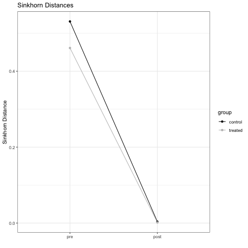
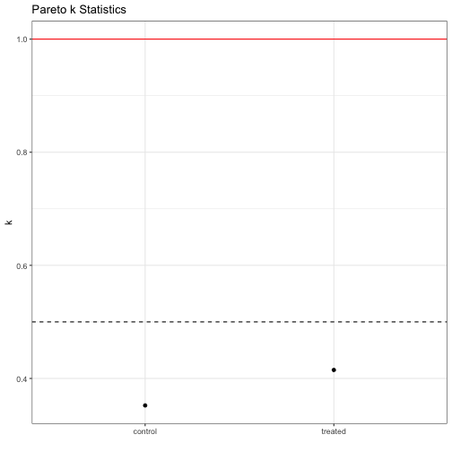
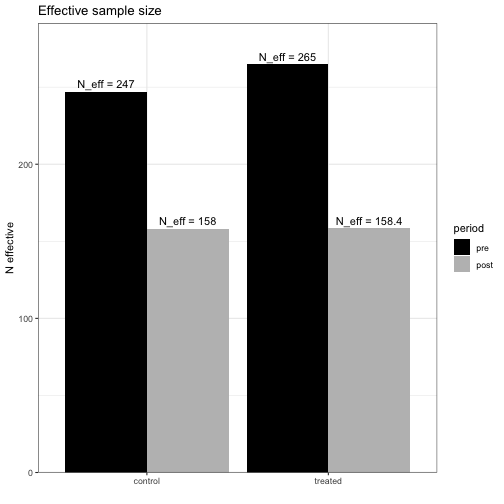
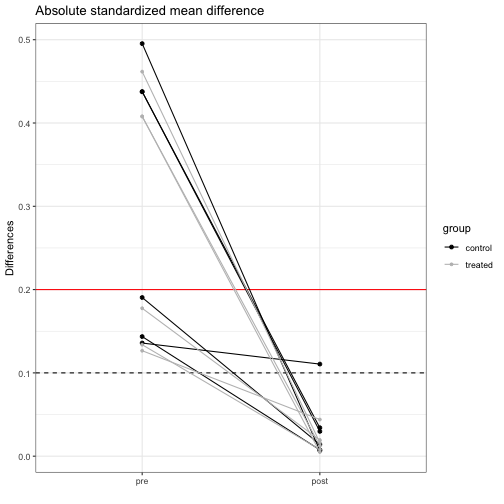

## Introduction
`causalOT` was developed to reproduce the methods in [*Optimal transport methods for causal inference*](https://arxiv.org/abs/2109.01991). The functions in the package are built to construct weights to make distributions more same and estimate causal effects. We recommend using the Causal Optimal Transport methods since they are semi- to non-parametric. This document will describe some simple usages of the functions in the package and should be enough to get users started.


## Estimating weights
The weights can be estimated by using the `calc_weight` function in the package. We select optimal hyperparameters through our bootstrap-based algorithm and target the average treatment effect.

```r
library(causalOT)
set.seed(1111)

hainmueller <- Hainmueller$new(n = 512)
hainmueller$gen_data()

x <- hainmueller$get_x()
z <- hainmueller$get_z()
y <- hainmueller$get_y()
weights <- calc_weight(x = x, z = z, method = "COT",
                       estimand = "ATE",
                       # default is torch's lbfgs where line search is important
                       options = list(line_search_fn = "strong_wolfe",
                       history_size = 10L, tol = 1e-3,
                       nboot = 1000L))
```
These weights will balance distributions, making estimates of treatment effects the same.

We can then estimate effects with 

```r
tau_hat <- estimate_effect(causalWeights = weights,
                           y = y,
                           estimate.separately = TRUE,
                           augmented.model = FALSE,
                           normalize.weights = TRUE)
```
This creates an object of class `causalEffect` which can be fed into the native `R` function `confint` to calculate asymptotic confidence intervals,

```r
ci_tau <- confint(object = tau_hat, level = 0.95)
```
or into `vcov` to calculate the variance of your estimate using the semiparametrically efficient variance formulae:

```r
var_tau <- vcov(object = tau_hat)
```
This then gives the following treatement effect estimate, variance, and C.I.

```r
print(tau_hat@estimate)
#> [1] 0.09160276
print(var_tau)
#>           estimate
#> estimate 0.1470094
print(ci_tau)
#>               2.5 %    97.5 %
#> estimate -0.6598827 0.8430882
```

## Diagnostics
Diagnostics are also an important part of deciding whether the weights perform well. There are several areas that we will explore:

1. Effective sample size
2. Mean balance
3. Distributional balance

#### 1. Effective sample size
Typically, estimated samples sizes with weights are calculated as $\sum_i 1/w_i^2$ and gives us a measure of how much information is in the sample. The lower the effective sample size (ESS), the higher the variance, and the lower the sample size, the more weight a few individuals have. Of course, we can calculate this in `causalOT`!

```r
ESS(weights)
#>  Control  Treated 
#> 156.6527 153.5573
```

Of course, this measure has problems because it can fail to diagnose problems with variable weights. In response, [Vehtari et al.](https://arxiv.org/abs/1507.02646) use Pareto smoothed importance sampling. We offer some shell code to adapt the class `causalWeights` to the `loo` package:

```r
raw_psis <- PSIS(weights)
```
This will also return the Pareto smoothed weights and log weights.

If we want to easily examine the PSIS diagnostics, we can pull those out too

```r
PSIS_diag(raw_psis)
#> $w0
#> $w0$pareto_k
#> [1] 0.3522737
#> 
#> $w0$n_eff
#> [1] 158.041
#> 
#> 
#> $w1
#> $w1$pareto_k
#> [1] 0.4149752
#> 
#> $w1$n_eff
#> [1] 158.3794
```
We can see that all of the $k$ values are below the recommended 0.5, indicating finite variance and that the central limit theorem holds. Note the estimated sample sizes are a bit lower than the `ESS` method above.

#### 2. Mean balance
Many authors consider the standardized absolute mean balance as a marker for important balance: see [Stuart (2010)](https://www.ncbi.nlm.nih.gov/pmc/articles/PMC2943670/). That is
$$ \frac{|\overline{X}_c - \overline{X}_t| }{\sigma_{\text{pool}}},$$ where
$\overline{X}_c$ is the mean in the controls, $\overline{X}_t$ is the mean in the treated, and $\sigma_{\text{pool}}$ is the pooled standard deviation.
We offer such checks in `causalOT` as well.

First, we consider pre-weighting mean balance

```r
mean_balance(x = hainmueller)
#>        X1        X2        X3        X4        X5        X6 
#> 1.0889178 0.9320099 0.9322327 0.3741322 0.2798986 0.2644929
```
and after weighting mean balance

```r
mean_balance(x = hainmueller, weights = weights)
#>          X1          X2          X3          X4          X5          X6 
#> 0.010963842 0.023804742 0.027403037 0.005396086 0.015731870 0.155767759
```
Pretty good!

However, mean balance doesn't ensure distributional balance.

#### 3. Distributional balance
Ultimately, distributional balance is what we care about in causal inference. Fortunately, we can also measure that too. We consider the 2-Sinkhorn divergence of [Genevay et al.](http://proceedings.mlr.press/v84/genevay18a/genevay18a.pdf) since it metrizes the convergence in distribution.

Before weighting, distributional balance looks poor:

```r
# controls
ot_distance(x1 = hainmueller$get_x0(), x2 = hainmueller$get_x(),
              a = NULL, b = rep(1/128,128),
              p = 2, penalty = 1e3, debias = TRUE)
#> Error in cpp_trace_function(tr_fn, list(...), .compilation_unit, strict, : Error in the R function execution.: Evaluation error: The size of tensor a (128) must match the size of tensor b (512) at non-singleton dimension 1
#> Exception raised from infer_size_impl at /Users/distiller/project/pytorch/aten/src/ATen/ExpandUtils.cpp:28 (most recent call first):
#> frame #0: c10::Error::Error(c10::SourceLocation, std::__1::basic_string<char, std::__1::char_traits<char>, std::__1::allocator<char> >) + 98 (0x112ae10c2 in libc10.dylib)
#> frame #1: c10::detail::torchCheckFail(char const*, char const*, unsigned int, std::__1::basic_string<char, std::__1::char_traits<char>, std::__1::allocator<char> > const&) + 106 (0x112adf7da in libc10.dylib)
#> frame #2: at::infer_size_dimvector(c10::ArrayRef<long long>, c10::ArrayRef<long long>) + 416 (0x1150f6b60 in libtorch_cpu.dylib)
#> frame #3: at::TensorIteratorBase::compute_shape(at::TensorIteratorConfig const&) + 513 (0x11512c1a1 in libtorch_cpu.dylib)
#> frame #4: at::TensorIteratorBase::build(at::TensorIteratorConfig&) + 611 (0x115127f23 in libtorch_cpu.dylib)
#> frame #5: at::TensorIteratorBase::build_borrowing_binary_op(at::TensorBase const&, at::TensorBase const&, at::TensorBase const&) + 169 (0x115129189 in libtorch_cpu.dylib)
#> frame #6: at::meta::structured_sub_Tensor::meta(at::Tensor const&, at::Tensor const&, c10::Scalar const&) + 109 (0x11530978d in libtorch_cpu.dylib)
#> frame #7: c10::impl::wrap_kernel_functor_unboxed_<c10::impl::detail::WrapFunctionIntoFunctor_<c10::CompileTimeFunctionPointer<at::Tensor (at::Tensor const&, at::Tensor const&, c10::Scalar const&), &(at::(anonymous namespace)::wrapper_sub_Tensor(at::Tensor const&, at::Tensor const&, c10::Scalar const&))>, at::Tensor, c10::guts::typelist::typelist<at::Tensor const&, at::Tensor const&, c10::Scalar const&> >, at::Tensor (at::Tensor const&, at::Tensor const&, c10::Scalar const&)>::call(c10::OperatorKernel*, c10::DispatchKeySet, at::Tensor const&, at::Tensor const&, c10::Scalar const&) + 103 (0x115e0d157 in libtorch_cpu.dylib)
#> frame #8: at::_ops::sub_Tensor::redispatch(c10::DispatchKeySet, at::Tensor const&, at::Tensor const&, c10::Scalar const&) + 139 (0x115cd2aeb in libtorch_cpu.dylib)
#> frame #9: c10::impl::wrap_kernel_functor_unboxed_<c10::impl::detail::WrapFunctionIntoFunctor_<c10::CompileTimeFunctionPointer<at::Tensor (c10::DispatchKeySet, at::Tensor const&, at::Tensor const&, c10::Scalar const&), &(torch::autograd::VariableType::(anonymous namespace)::sub_Tensor(c10::DispatchKeySet, at::Tensor const&, at::Tensor const&, c10::Scalar const&))>, at::Tensor, c10::guts::typelist::typelist<c10::DispatchKeySet, at::Tensor const&, at::Tensor const&, c10::Scalar const&> >, at::Tensor (c10::DispatchKeySet, at::Tensor const&, at::Tensor const&, c10::Scalar const&)>::call(c10::OperatorKernel*, c10::DispatchKeySet, at::Tensor const&, at::Tensor const&, c10::Scalar const&) + 1140 (0x117040564 in libtorch_cpu.dylib)
#> frame #10: at::_ops::sub_Tensor::redispatch(c10::DispatchKeySet, at::Tensor const&, at::Tensor const&, c10::Scalar const&) + 139 (0x115cd2aeb in libtorch_cpu.dylib)
#> frame #11: c10::impl::wrap_kernel_functor_unboxed_<c10::impl::detail::WrapFunctionIntoFunctor_<c10::CompileTimeFunctionPointer<at::Tensor (c10::DispatchKeySet, at::Tensor const&, at::Tensor const&, c10::Scalar const&), &(torch::TraceType::(anonymous namespace)::sub_Tensor(c10::DispatchKeySet, at::Tensor const&, at::Tensor const&, c10::Scalar const&))>, at::Tensor, c10::guts::typelist::typelist<c10::DispatchKeySet, at::Tensor const&, at::Tensor const&, c10::Scalar const&> >, at::Tensor (c10::DispatchKeySet, at::Tensor const&, at::Tensor const&, c10::Scalar const&)>::call(c10::OperatorKernel*, c10::DispatchKeySet, at::Tensor const&, at::Tensor const&, c10::Scalar const&) + 334 (0x11733c94e in libtorch_cpu.dylib)
#> frame #12: at::_ops::sub_Tensor::call(at::Tensor const&, at::Tensor const&, c10::Scalar const&) + 255 (0x115cd27ff in libtorch_cpu.dylib)
#> frame #13: at::sub(at::Tensor const&, at::Tensor const&, c10::Scalar const&) + 51 (0x112245913 in liblantern.dylib)
#> frame #14: _lantern_sub_tensor_tensor_scalar + 323 (0x112245233 in liblantern.dylib)
#> frame #15: cpp_torch_namespace_sub_self_Tensor_other_Tensor(XPtrTorchTensor, XPtrTorchTensor, XPtrTorchScalar) + 64 (0x11185b420 in torchpkg.so)
#> frame #16: _torch_cpp_torch_namespace_sub_self_Tensor_other_Tensor + 518 (0x111508e36 in torchpkg.so)
#> frame #17: R_doDotCall + 1458 (0x105ed3a62 in libR.dylib)
#> frame #18: do_dotcall + 334 (0x105ed53ee in libR.dylib)
#> frame #19: bcEval + 28565 (0x105f0d1b5 in libR.dylib)
#> frame #20: Rf_eval + 385 (0x105f05b81 in libR.dylib)
#> frame #21: R_execClosure + 2169 (0x105f259b9 in libR.dylib)
#> frame #22: Rf_applyClosure + 471 (0x105f247a7 in libR.dylib)
#> frame #23: Rf_eval + 1595 (0x105f0603b in libR.dylib)
#> frame #24: do_docall + 641 (0x105ea1871 in libR.dylib)
#> frame #25: bcEval + 28565 (0x105f0d1b5 in libR.dylib)
#> frame #26: Rf_eval + 385 (0x105f05b81 in libR.dylib)
#> frame #27: R_execClosure + 2169 (0x105f259b9 in libR.dylib)
#> frame #28: Rf_applyClosure + 471 (0x105f247a7 in libR.dylib)
#> frame #29: bcEval + 26766 (0x105f0caae in libR.dylib)
#> frame #30: Rf_eval + 385 (0x105f05b81 in libR.dylib)
#> frame #31: R_execClosure + 2169 (0x105f259b9 in libR.dylib)
#> frame #32: Rf_applyClosure + 471 (0x105f247a7 in libR.dylib)
#> frame #33: bcEval + 26766 (0x105f0caae in libR.dylib)
#> frame #34: Rf_eval + 385 (0x105f05b81 in libR.dylib)
#> frame #35: R_execClosure + 2169 (0x105f259b9 in libR.dylib)
#> frame #36: Rf_applyClosure + 471 (0x105f247a7 in libR.dylib)
#> frame #37: bcEval + 26766 (0x105f0caae in libR.dylib)
#> frame #38: Rf_eval + 385 (0x105f05b81 in libR.dylib)
#> frame #39: R_execClosure + 2169 (0x105f259b9 in libR.dylib)
#> frame #40: Rf_applyClosure + 471 (0x105f247a7 in libR.dylib)
#> frame #41: bcEval + 26766 (0x105f0caae in libR.dylib)
#> frame #42: Rf_eval + 385 (0x105f05b81 in libR.dylib)
#> frame #43: R_execClosure + 2169 (0x105f259b9 in libR.dylib)
#> frame #44: Rf_applyClosure + 471 (0x105f247a7 in libR.dylib)
#> frame #45: Rf_DispatchGroup + 2439 (0x105f2b507 in libR.dylib)
#> frame #46: do_arith + 235 (0x105e65dfb in libR.dylib)
#> frame #47: Rf_eval + 1634 (0x105f06062 in libR.dylib)
#> frame #48: Rf_evalList + 168 (0x105f23fc8 in libR.dylib)
#> frame #49: Rf_eval + 1210 (0x105f05eba in libR.dylib)
#> frame #50: R_DispatchOrEvalSP + 92 (0x105febfac in libR.dylib)
#> frame #51: do_subset3 + 135 (0x105ff03b7 in libR.dylib)
#> frame #52: Rf_eval + 887 (0x105f05d77 in libR.dylib)
#> frame #53: Rf_eval + 559 (0x105f05c2f in libR.dylib)
#> frame #54: Rf_evalList + 168 (0x105f23fc8 in libR.dylib)
#> frame #55: Rf_eval + 1210 (0x105f05eba in libR.dylib)
#> frame #56: do_return + 92 (0x105f283cc in libR.dylib)
#> frame #57: Rf_eval + 887 (0x105f05d77 in libR.dylib)
#> frame #58: do_begin + 462 (0x105f2830e in libR.dylib)
#> frame #59: Rf_eval + 887 (0x105f05d77 in libR.dylib)
#> frame #60: R_execClosure + 2169 (0x105f259b9 in libR.dylib)
#> frame #61: Rf_applyClosure + 471 (0x105f247a7 in libR.dylib)
#> frame #62: Rf_eval + 1595 (0x105f0603b in libR.dylib)
#> frame #63: do_docall + 641 (0x105ea1871 in libR.dylib)
#> .
#treated
ot_distance(x1 = hainmueller$get_x1(), x2 = hainmueller$get_x(),
              a = NULL, b = rep(1/128,128),
              p = 2, penalty = 1e3, debias = TRUE)
#> Error in cpp_trace_function(tr_fn, list(...), .compilation_unit, strict, : Error in the R function execution.: Evaluation error: The size of tensor a (128) must match the size of tensor b (512) at non-singleton dimension 1
#> Exception raised from infer_size_impl at /Users/distiller/project/pytorch/aten/src/ATen/ExpandUtils.cpp:28 (most recent call first):
#> frame #0: c10::Error::Error(c10::SourceLocation, std::__1::basic_string<char, std::__1::char_traits<char>, std::__1::allocator<char> >) + 98 (0x112ae10c2 in libc10.dylib)
#> frame #1: c10::detail::torchCheckFail(char const*, char const*, unsigned int, std::__1::basic_string<char, std::__1::char_traits<char>, std::__1::allocator<char> > const&) + 106 (0x112adf7da in libc10.dylib)
#> frame #2: at::infer_size_dimvector(c10::ArrayRef<long long>, c10::ArrayRef<long long>) + 416 (0x1150f6b60 in libtorch_cpu.dylib)
#> frame #3: at::TensorIteratorBase::compute_shape(at::TensorIteratorConfig const&) + 513 (0x11512c1a1 in libtorch_cpu.dylib)
#> frame #4: at::TensorIteratorBase::build(at::TensorIteratorConfig&) + 611 (0x115127f23 in libtorch_cpu.dylib)
#> frame #5: at::TensorIteratorBase::build_borrowing_binary_op(at::TensorBase const&, at::TensorBase const&, at::TensorBase const&) + 169 (0x115129189 in libtorch_cpu.dylib)
#> frame #6: at::meta::structured_sub_Tensor::meta(at::Tensor const&, at::Tensor const&, c10::Scalar const&) + 109 (0x11530978d in libtorch_cpu.dylib)
#> frame #7: c10::impl::wrap_kernel_functor_unboxed_<c10::impl::detail::WrapFunctionIntoFunctor_<c10::CompileTimeFunctionPointer<at::Tensor (at::Tensor const&, at::Tensor const&, c10::Scalar const&), &(at::(anonymous namespace)::wrapper_sub_Tensor(at::Tensor const&, at::Tensor const&, c10::Scalar const&))>, at::Tensor, c10::guts::typelist::typelist<at::Tensor const&, at::Tensor const&, c10::Scalar const&> >, at::Tensor (at::Tensor const&, at::Tensor const&, c10::Scalar const&)>::call(c10::OperatorKernel*, c10::DispatchKeySet, at::Tensor const&, at::Tensor const&, c10::Scalar const&) + 103 (0x115e0d157 in libtorch_cpu.dylib)
#> frame #8: at::_ops::sub_Tensor::redispatch(c10::DispatchKeySet, at::Tensor const&, at::Tensor const&, c10::Scalar const&) + 139 (0x115cd2aeb in libtorch_cpu.dylib)
#> frame #9: c10::impl::wrap_kernel_functor_unboxed_<c10::impl::detail::WrapFunctionIntoFunctor_<c10::CompileTimeFunctionPointer<at::Tensor (c10::DispatchKeySet, at::Tensor const&, at::Tensor const&, c10::Scalar const&), &(torch::autograd::VariableType::(anonymous namespace)::sub_Tensor(c10::DispatchKeySet, at::Tensor const&, at::Tensor const&, c10::Scalar const&))>, at::Tensor, c10::guts::typelist::typelist<c10::DispatchKeySet, at::Tensor const&, at::Tensor const&, c10::Scalar const&> >, at::Tensor (c10::DispatchKeySet, at::Tensor const&, at::Tensor const&, c10::Scalar const&)>::call(c10::OperatorKernel*, c10::DispatchKeySet, at::Tensor const&, at::Tensor const&, c10::Scalar const&) + 1140 (0x117040564 in libtorch_cpu.dylib)
#> frame #10: at::_ops::sub_Tensor::redispatch(c10::DispatchKeySet, at::Tensor const&, at::Tensor const&, c10::Scalar const&) + 139 (0x115cd2aeb in libtorch_cpu.dylib)
#> frame #11: c10::impl::wrap_kernel_functor_unboxed_<c10::impl::detail::WrapFunctionIntoFunctor_<c10::CompileTimeFunctionPointer<at::Tensor (c10::DispatchKeySet, at::Tensor const&, at::Tensor const&, c10::Scalar const&), &(torch::TraceType::(anonymous namespace)::sub_Tensor(c10::DispatchKeySet, at::Tensor const&, at::Tensor const&, c10::Scalar const&))>, at::Tensor, c10::guts::typelist::typelist<c10::DispatchKeySet, at::Tensor const&, at::Tensor const&, c10::Scalar const&> >, at::Tensor (c10::DispatchKeySet, at::Tensor const&, at::Tensor const&, c10::Scalar const&)>::call(c10::OperatorKernel*, c10::DispatchKeySet, at::Tensor const&, at::Tensor const&, c10::Scalar const&) + 334 (0x11733c94e in libtorch_cpu.dylib)
#> frame #12: at::_ops::sub_Tensor::call(at::Tensor const&, at::Tensor const&, c10::Scalar const&) + 255 (0x115cd27ff in libtorch_cpu.dylib)
#> frame #13: at::sub(at::Tensor const&, at::Tensor const&, c10::Scalar const&) + 51 (0x112245913 in liblantern.dylib)
#> frame #14: _lantern_sub_tensor_tensor_scalar + 323 (0x112245233 in liblantern.dylib)
#> frame #15: cpp_torch_namespace_sub_self_Tensor_other_Tensor(XPtrTorchTensor, XPtrTorchTensor, XPtrTorchScalar) + 64 (0x11185b420 in torchpkg.so)
#> frame #16: _torch_cpp_torch_namespace_sub_self_Tensor_other_Tensor + 518 (0x111508e36 in torchpkg.so)
#> frame #17: R_doDotCall + 1458 (0x105ed3a62 in libR.dylib)
#> frame #18: do_dotcall + 334 (0x105ed53ee in libR.dylib)
#> frame #19: bcEval + 28565 (0x105f0d1b5 in libR.dylib)
#> frame #20: Rf_eval + 385 (0x105f05b81 in libR.dylib)
#> frame #21: R_execClosure + 2169 (0x105f259b9 in libR.dylib)
#> frame #22: Rf_applyClosure + 471 (0x105f247a7 in libR.dylib)
#> frame #23: Rf_eval + 1595 (0x105f0603b in libR.dylib)
#> frame #24: do_docall + 641 (0x105ea1871 in libR.dylib)
#> frame #25: bcEval + 28565 (0x105f0d1b5 in libR.dylib)
#> frame #26: Rf_eval + 385 (0x105f05b81 in libR.dylib)
#> frame #27: R_execClosure + 2169 (0x105f259b9 in libR.dylib)
#> frame #28: Rf_applyClosure + 471 (0x105f247a7 in libR.dylib)
#> frame #29: bcEval + 26766 (0x105f0caae in libR.dylib)
#> frame #30: Rf_eval + 385 (0x105f05b81 in libR.dylib)
#> frame #31: R_execClosure + 2169 (0x105f259b9 in libR.dylib)
#> frame #32: Rf_applyClosure + 471 (0x105f247a7 in libR.dylib)
#> frame #33: bcEval + 26766 (0x105f0caae in libR.dylib)
#> frame #34: Rf_eval + 385 (0x105f05b81 in libR.dylib)
#> frame #35: R_execClosure + 2169 (0x105f259b9 in libR.dylib)
#> frame #36: Rf_applyClosure + 471 (0x105f247a7 in libR.dylib)
#> frame #37: bcEval + 26766 (0x105f0caae in libR.dylib)
#> frame #38: Rf_eval + 385 (0x105f05b81 in libR.dylib)
#> frame #39: R_execClosure + 2169 (0x105f259b9 in libR.dylib)
#> frame #40: Rf_applyClosure + 471 (0x105f247a7 in libR.dylib)
#> frame #41: bcEval + 26766 (0x105f0caae in libR.dylib)
#> frame #42: Rf_eval + 385 (0x105f05b81 in libR.dylib)
#> frame #43: R_execClosure + 2169 (0x105f259b9 in libR.dylib)
#> frame #44: Rf_applyClosure + 471 (0x105f247a7 in libR.dylib)
#> frame #45: Rf_DispatchGroup + 2439 (0x105f2b507 in libR.dylib)
#> frame #46: do_arith + 235 (0x105e65dfb in libR.dylib)
#> frame #47: Rf_eval + 1634 (0x105f06062 in libR.dylib)
#> frame #48: Rf_evalList + 168 (0x105f23fc8 in libR.dylib)
#> frame #49: Rf_eval + 1210 (0x105f05eba in libR.dylib)
#> frame #50: R_DispatchOrEvalSP + 92 (0x105febfac in libR.dylib)
#> frame #51: do_subset3 + 135 (0x105ff03b7 in libR.dylib)
#> frame #52: Rf_eval + 887 (0x105f05d77 in libR.dylib)
#> frame #53: Rf_eval + 559 (0x105f05c2f in libR.dylib)
#> frame #54: Rf_evalList + 168 (0x105f23fc8 in libR.dylib)
#> frame #55: Rf_eval + 1210 (0x105f05eba in libR.dylib)
#> frame #56: do_return + 92 (0x105f283cc in libR.dylib)
#> frame #57: Rf_eval + 887 (0x105f05d77 in libR.dylib)
#> frame #58: do_begin + 462 (0x105f2830e in libR.dylib)
#> frame #59: Rf_eval + 887 (0x105f05d77 in libR.dylib)
#> frame #60: R_execClosure + 2169 (0x105f259b9 in libR.dylib)
#> frame #61: Rf_applyClosure + 471 (0x105f247a7 in libR.dylib)
#> frame #62: Rf_eval + 1595 (0x105f0603b in libR.dylib)
#> frame #63: do_docall + 641 (0x105ea1871 in libR.dylib)
#> .
```

But after weighting, it looks much better!

```r
# controls
ot_distance(x1 = hainmueller$get_x0(), x2 = hainmueller$get_x(),
              a = weights@w0, b = rep(1/128,128),
              p = 2, penalty = 1e3, debias = TRUE)
#> Error in cpp_trace_function(tr_fn, list(...), .compilation_unit, strict, : Error in the R function execution.: Evaluation error: The size of tensor a (128) must match the size of tensor b (512) at non-singleton dimension 1
#> Exception raised from infer_size_impl at /Users/distiller/project/pytorch/aten/src/ATen/ExpandUtils.cpp:28 (most recent call first):
#> frame #0: c10::Error::Error(c10::SourceLocation, std::__1::basic_string<char, std::__1::char_traits<char>, std::__1::allocator<char> >) + 98 (0x112ae10c2 in libc10.dylib)
#> frame #1: c10::detail::torchCheckFail(char const*, char const*, unsigned int, std::__1::basic_string<char, std::__1::char_traits<char>, std::__1::allocator<char> > const&) + 106 (0x112adf7da in libc10.dylib)
#> frame #2: at::infer_size_dimvector(c10::ArrayRef<long long>, c10::ArrayRef<long long>) + 416 (0x1150f6b60 in libtorch_cpu.dylib)
#> frame #3: at::TensorIteratorBase::compute_shape(at::TensorIteratorConfig const&) + 513 (0x11512c1a1 in libtorch_cpu.dylib)
#> frame #4: at::TensorIteratorBase::build(at::TensorIteratorConfig&) + 611 (0x115127f23 in libtorch_cpu.dylib)
#> frame #5: at::TensorIteratorBase::build_borrowing_binary_op(at::TensorBase const&, at::TensorBase const&, at::TensorBase const&) + 169 (0x115129189 in libtorch_cpu.dylib)
#> frame #6: at::meta::structured_sub_Tensor::meta(at::Tensor const&, at::Tensor const&, c10::Scalar const&) + 109 (0x11530978d in libtorch_cpu.dylib)
#> frame #7: c10::impl::wrap_kernel_functor_unboxed_<c10::impl::detail::WrapFunctionIntoFunctor_<c10::CompileTimeFunctionPointer<at::Tensor (at::Tensor const&, at::Tensor const&, c10::Scalar const&), &(at::(anonymous namespace)::wrapper_sub_Tensor(at::Tensor const&, at::Tensor const&, c10::Scalar const&))>, at::Tensor, c10::guts::typelist::typelist<at::Tensor const&, at::Tensor const&, c10::Scalar const&> >, at::Tensor (at::Tensor const&, at::Tensor const&, c10::Scalar const&)>::call(c10::OperatorKernel*, c10::DispatchKeySet, at::Tensor const&, at::Tensor const&, c10::Scalar const&) + 103 (0x115e0d157 in libtorch_cpu.dylib)
#> frame #8: at::_ops::sub_Tensor::redispatch(c10::DispatchKeySet, at::Tensor const&, at::Tensor const&, c10::Scalar const&) + 139 (0x115cd2aeb in libtorch_cpu.dylib)
#> frame #9: c10::impl::wrap_kernel_functor_unboxed_<c10::impl::detail::WrapFunctionIntoFunctor_<c10::CompileTimeFunctionPointer<at::Tensor (c10::DispatchKeySet, at::Tensor const&, at::Tensor const&, c10::Scalar const&), &(torch::autograd::VariableType::(anonymous namespace)::sub_Tensor(c10::DispatchKeySet, at::Tensor const&, at::Tensor const&, c10::Scalar const&))>, at::Tensor, c10::guts::typelist::typelist<c10::DispatchKeySet, at::Tensor const&, at::Tensor const&, c10::Scalar const&> >, at::Tensor (c10::DispatchKeySet, at::Tensor const&, at::Tensor const&, c10::Scalar const&)>::call(c10::OperatorKernel*, c10::DispatchKeySet, at::Tensor const&, at::Tensor const&, c10::Scalar const&) + 1140 (0x117040564 in libtorch_cpu.dylib)
#> frame #10: at::_ops::sub_Tensor::redispatch(c10::DispatchKeySet, at::Tensor const&, at::Tensor const&, c10::Scalar const&) + 139 (0x115cd2aeb in libtorch_cpu.dylib)
#> frame #11: c10::impl::wrap_kernel_functor_unboxed_<c10::impl::detail::WrapFunctionIntoFunctor_<c10::CompileTimeFunctionPointer<at::Tensor (c10::DispatchKeySet, at::Tensor const&, at::Tensor const&, c10::Scalar const&), &(torch::TraceType::(anonymous namespace)::sub_Tensor(c10::DispatchKeySet, at::Tensor const&, at::Tensor const&, c10::Scalar const&))>, at::Tensor, c10::guts::typelist::typelist<c10::DispatchKeySet, at::Tensor const&, at::Tensor const&, c10::Scalar const&> >, at::Tensor (c10::DispatchKeySet, at::Tensor const&, at::Tensor const&, c10::Scalar const&)>::call(c10::OperatorKernel*, c10::DispatchKeySet, at::Tensor const&, at::Tensor const&, c10::Scalar const&) + 334 (0x11733c94e in libtorch_cpu.dylib)
#> frame #12: at::_ops::sub_Tensor::call(at::Tensor const&, at::Tensor const&, c10::Scalar const&) + 255 (0x115cd27ff in libtorch_cpu.dylib)
#> frame #13: at::sub(at::Tensor const&, at::Tensor const&, c10::Scalar const&) + 51 (0x112245913 in liblantern.dylib)
#> frame #14: _lantern_sub_tensor_tensor_scalar + 323 (0x112245233 in liblantern.dylib)
#> frame #15: cpp_torch_namespace_sub_self_Tensor_other_Tensor(XPtrTorchTensor, XPtrTorchTensor, XPtrTorchScalar) + 64 (0x11185b420 in torchpkg.so)
#> frame #16: _torch_cpp_torch_namespace_sub_self_Tensor_other_Tensor + 518 (0x111508e36 in torchpkg.so)
#> frame #17: R_doDotCall + 1458 (0x105ed3a62 in libR.dylib)
#> frame #18: do_dotcall + 334 (0x105ed53ee in libR.dylib)
#> frame #19: bcEval + 28565 (0x105f0d1b5 in libR.dylib)
#> frame #20: Rf_eval + 385 (0x105f05b81 in libR.dylib)
#> frame #21: R_execClosure + 2169 (0x105f259b9 in libR.dylib)
#> frame #22: Rf_applyClosure + 471 (0x105f247a7 in libR.dylib)
#> frame #23: Rf_eval + 1595 (0x105f0603b in libR.dylib)
#> frame #24: do_docall + 641 (0x105ea1871 in libR.dylib)
#> frame #25: bcEval + 28565 (0x105f0d1b5 in libR.dylib)
#> frame #26: Rf_eval + 385 (0x105f05b81 in libR.dylib)
#> frame #27: R_execClosure + 2169 (0x105f259b9 in libR.dylib)
#> frame #28: Rf_applyClosure + 471 (0x105f247a7 in libR.dylib)
#> frame #29: bcEval + 26766 (0x105f0caae in libR.dylib)
#> frame #30: Rf_eval + 385 (0x105f05b81 in libR.dylib)
#> frame #31: R_execClosure + 2169 (0x105f259b9 in libR.dylib)
#> frame #32: Rf_applyClosure + 471 (0x105f247a7 in libR.dylib)
#> frame #33: bcEval + 26766 (0x105f0caae in libR.dylib)
#> frame #34: Rf_eval + 385 (0x105f05b81 in libR.dylib)
#> frame #35: R_execClosure + 2169 (0x105f259b9 in libR.dylib)
#> frame #36: Rf_applyClosure + 471 (0x105f247a7 in libR.dylib)
#> frame #37: bcEval + 26766 (0x105f0caae in libR.dylib)
#> frame #38: Rf_eval + 385 (0x105f05b81 in libR.dylib)
#> frame #39: R_execClosure + 2169 (0x105f259b9 in libR.dylib)
#> frame #40: Rf_applyClosure + 471 (0x105f247a7 in libR.dylib)
#> frame #41: bcEval + 26766 (0x105f0caae in libR.dylib)
#> frame #42: Rf_eval + 385 (0x105f05b81 in libR.dylib)
#> frame #43: R_execClosure + 2169 (0x105f259b9 in libR.dylib)
#> frame #44: Rf_applyClosure + 471 (0x105f247a7 in libR.dylib)
#> frame #45: Rf_DispatchGroup + 2439 (0x105f2b507 in libR.dylib)
#> frame #46: do_arith + 235 (0x105e65dfb in libR.dylib)
#> frame #47: Rf_eval + 1634 (0x105f06062 in libR.dylib)
#> frame #48: Rf_evalList + 168 (0x105f23fc8 in libR.dylib)
#> frame #49: Rf_eval + 1210 (0x105f05eba in libR.dylib)
#> frame #50: R_DispatchOrEvalSP + 92 (0x105febfac in libR.dylib)
#> frame #51: do_subset3 + 135 (0x105ff03b7 in libR.dylib)
#> frame #52: Rf_eval + 887 (0x105f05d77 in libR.dylib)
#> frame #53: Rf_eval + 559 (0x105f05c2f in libR.dylib)
#> frame #54: Rf_evalList + 168 (0x105f23fc8 in libR.dylib)
#> frame #55: Rf_eval + 1210 (0x105f05eba in libR.dylib)
#> frame #56: do_return + 92 (0x105f283cc in libR.dylib)
#> frame #57: Rf_eval + 887 (0x105f05d77 in libR.dylib)
#> frame #58: do_begin + 462 (0x105f2830e in libR.dylib)
#> frame #59: Rf_eval + 887 (0x105f05d77 in libR.dylib)
#> frame #60: R_execClosure + 2169 (0x105f259b9 in libR.dylib)
#> frame #61: Rf_applyClosure + 471 (0x105f247a7 in libR.dylib)
#> frame #62: Rf_eval + 1595 (0x105f0603b in libR.dylib)
#> frame #63: do_docall + 641 (0x105ea1871 in libR.dylib)
#> .
# treated
ot_distance(x1 = hainmueller$get_x1(), x2 = hainmueller$get_x(),
              a = weights@w1, b = rep(1/128,128),
              p = 2, penalty = 1e3, debias = TRUE)
#> Error in cpp_trace_function(tr_fn, list(...), .compilation_unit, strict, : Error in the R function execution.: Evaluation error: The size of tensor a (128) must match the size of tensor b (512) at non-singleton dimension 1
#> Exception raised from infer_size_impl at /Users/distiller/project/pytorch/aten/src/ATen/ExpandUtils.cpp:28 (most recent call first):
#> frame #0: c10::Error::Error(c10::SourceLocation, std::__1::basic_string<char, std::__1::char_traits<char>, std::__1::allocator<char> >) + 98 (0x112ae10c2 in libc10.dylib)
#> frame #1: c10::detail::torchCheckFail(char const*, char const*, unsigned int, std::__1::basic_string<char, std::__1::char_traits<char>, std::__1::allocator<char> > const&) + 106 (0x112adf7da in libc10.dylib)
#> frame #2: at::infer_size_dimvector(c10::ArrayRef<long long>, c10::ArrayRef<long long>) + 416 (0x1150f6b60 in libtorch_cpu.dylib)
#> frame #3: at::TensorIteratorBase::compute_shape(at::TensorIteratorConfig const&) + 513 (0x11512c1a1 in libtorch_cpu.dylib)
#> frame #4: at::TensorIteratorBase::build(at::TensorIteratorConfig&) + 611 (0x115127f23 in libtorch_cpu.dylib)
#> frame #5: at::TensorIteratorBase::build_borrowing_binary_op(at::TensorBase const&, at::TensorBase const&, at::TensorBase const&) + 169 (0x115129189 in libtorch_cpu.dylib)
#> frame #6: at::meta::structured_sub_Tensor::meta(at::Tensor const&, at::Tensor const&, c10::Scalar const&) + 109 (0x11530978d in libtorch_cpu.dylib)
#> frame #7: c10::impl::wrap_kernel_functor_unboxed_<c10::impl::detail::WrapFunctionIntoFunctor_<c10::CompileTimeFunctionPointer<at::Tensor (at::Tensor const&, at::Tensor const&, c10::Scalar const&), &(at::(anonymous namespace)::wrapper_sub_Tensor(at::Tensor const&, at::Tensor const&, c10::Scalar const&))>, at::Tensor, c10::guts::typelist::typelist<at::Tensor const&, at::Tensor const&, c10::Scalar const&> >, at::Tensor (at::Tensor const&, at::Tensor const&, c10::Scalar const&)>::call(c10::OperatorKernel*, c10::DispatchKeySet, at::Tensor const&, at::Tensor const&, c10::Scalar const&) + 103 (0x115e0d157 in libtorch_cpu.dylib)
#> frame #8: at::_ops::sub_Tensor::redispatch(c10::DispatchKeySet, at::Tensor const&, at::Tensor const&, c10::Scalar const&) + 139 (0x115cd2aeb in libtorch_cpu.dylib)
#> frame #9: c10::impl::wrap_kernel_functor_unboxed_<c10::impl::detail::WrapFunctionIntoFunctor_<c10::CompileTimeFunctionPointer<at::Tensor (c10::DispatchKeySet, at::Tensor const&, at::Tensor const&, c10::Scalar const&), &(torch::autograd::VariableType::(anonymous namespace)::sub_Tensor(c10::DispatchKeySet, at::Tensor const&, at::Tensor const&, c10::Scalar const&))>, at::Tensor, c10::guts::typelist::typelist<c10::DispatchKeySet, at::Tensor const&, at::Tensor const&, c10::Scalar const&> >, at::Tensor (c10::DispatchKeySet, at::Tensor const&, at::Tensor const&, c10::Scalar const&)>::call(c10::OperatorKernel*, c10::DispatchKeySet, at::Tensor const&, at::Tensor const&, c10::Scalar const&) + 1140 (0x117040564 in libtorch_cpu.dylib)
#> frame #10: at::_ops::sub_Tensor::redispatch(c10::DispatchKeySet, at::Tensor const&, at::Tensor const&, c10::Scalar const&) + 139 (0x115cd2aeb in libtorch_cpu.dylib)
#> frame #11: c10::impl::wrap_kernel_functor_unboxed_<c10::impl::detail::WrapFunctionIntoFunctor_<c10::CompileTimeFunctionPointer<at::Tensor (c10::DispatchKeySet, at::Tensor const&, at::Tensor const&, c10::Scalar const&), &(torch::TraceType::(anonymous namespace)::sub_Tensor(c10::DispatchKeySet, at::Tensor const&, at::Tensor const&, c10::Scalar const&))>, at::Tensor, c10::guts::typelist::typelist<c10::DispatchKeySet, at::Tensor const&, at::Tensor const&, c10::Scalar const&> >, at::Tensor (c10::DispatchKeySet, at::Tensor const&, at::Tensor const&, c10::Scalar const&)>::call(c10::OperatorKernel*, c10::DispatchKeySet, at::Tensor const&, at::Tensor const&, c10::Scalar const&) + 334 (0x11733c94e in libtorch_cpu.dylib)
#> frame #12: at::_ops::sub_Tensor::call(at::Tensor const&, at::Tensor const&, c10::Scalar const&) + 255 (0x115cd27ff in libtorch_cpu.dylib)
#> frame #13: at::sub(at::Tensor const&, at::Tensor const&, c10::Scalar const&) + 51 (0x112245913 in liblantern.dylib)
#> frame #14: _lantern_sub_tensor_tensor_scalar + 323 (0x112245233 in liblantern.dylib)
#> frame #15: cpp_torch_namespace_sub_self_Tensor_other_Tensor(XPtrTorchTensor, XPtrTorchTensor, XPtrTorchScalar) + 64 (0x11185b420 in torchpkg.so)
#> frame #16: _torch_cpp_torch_namespace_sub_self_Tensor_other_Tensor + 518 (0x111508e36 in torchpkg.so)
#> frame #17: R_doDotCall + 1458 (0x105ed3a62 in libR.dylib)
#> frame #18: do_dotcall + 334 (0x105ed53ee in libR.dylib)
#> frame #19: bcEval + 28565 (0x105f0d1b5 in libR.dylib)
#> frame #20: Rf_eval + 385 (0x105f05b81 in libR.dylib)
#> frame #21: R_execClosure + 2169 (0x105f259b9 in libR.dylib)
#> frame #22: Rf_applyClosure + 471 (0x105f247a7 in libR.dylib)
#> frame #23: Rf_eval + 1595 (0x105f0603b in libR.dylib)
#> frame #24: do_docall + 641 (0x105ea1871 in libR.dylib)
#> frame #25: bcEval + 28565 (0x105f0d1b5 in libR.dylib)
#> frame #26: Rf_eval + 385 (0x105f05b81 in libR.dylib)
#> frame #27: R_execClosure + 2169 (0x105f259b9 in libR.dylib)
#> frame #28: Rf_applyClosure + 471 (0x105f247a7 in libR.dylib)
#> frame #29: bcEval + 26766 (0x105f0caae in libR.dylib)
#> frame #30: Rf_eval + 385 (0x105f05b81 in libR.dylib)
#> frame #31: R_execClosure + 2169 (0x105f259b9 in libR.dylib)
#> frame #32: Rf_applyClosure + 471 (0x105f247a7 in libR.dylib)
#> frame #33: bcEval + 26766 (0x105f0caae in libR.dylib)
#> frame #34: Rf_eval + 385 (0x105f05b81 in libR.dylib)
#> frame #35: R_execClosure + 2169 (0x105f259b9 in libR.dylib)
#> frame #36: Rf_applyClosure + 471 (0x105f247a7 in libR.dylib)
#> frame #37: bcEval + 26766 (0x105f0caae in libR.dylib)
#> frame #38: Rf_eval + 385 (0x105f05b81 in libR.dylib)
#> frame #39: R_execClosure + 2169 (0x105f259b9 in libR.dylib)
#> frame #40: Rf_applyClosure + 471 (0x105f247a7 in libR.dylib)
#> frame #41: bcEval + 26766 (0x105f0caae in libR.dylib)
#> frame #42: Rf_eval + 385 (0x105f05b81 in libR.dylib)
#> frame #43: R_execClosure + 2169 (0x105f259b9 in libR.dylib)
#> frame #44: Rf_applyClosure + 471 (0x105f247a7 in libR.dylib)
#> frame #45: Rf_DispatchGroup + 2439 (0x105f2b507 in libR.dylib)
#> frame #46: do_arith + 235 (0x105e65dfb in libR.dylib)
#> frame #47: Rf_eval + 1634 (0x105f06062 in libR.dylib)
#> frame #48: Rf_evalList + 168 (0x105f23fc8 in libR.dylib)
#> frame #49: Rf_eval + 1210 (0x105f05eba in libR.dylib)
#> frame #50: R_DispatchOrEvalSP + 92 (0x105febfac in libR.dylib)
#> frame #51: do_subset3 + 135 (0x105ff03b7 in libR.dylib)
#> frame #52: Rf_eval + 887 (0x105f05d77 in libR.dylib)
#> frame #53: Rf_eval + 559 (0x105f05c2f in libR.dylib)
#> frame #54: Rf_evalList + 168 (0x105f23fc8 in libR.dylib)
#> frame #55: Rf_eval + 1210 (0x105f05eba in libR.dylib)
#> frame #56: do_return + 92 (0x105f283cc in libR.dylib)
#> frame #57: Rf_eval + 887 (0x105f05d77 in libR.dylib)
#> frame #58: do_begin + 462 (0x105f2830e in libR.dylib)
#> frame #59: Rf_eval + 887 (0x105f05d77 in libR.dylib)
#> frame #60: R_execClosure + 2169 (0x105f259b9 in libR.dylib)
#> frame #61: Rf_applyClosure + 471 (0x105f247a7 in libR.dylib)
#> frame #62: Rf_eval + 1595 (0x105f0603b in libR.dylib)
#> frame #63: do_docall + 641 (0x105ea1871 in libR.dylib)
#> .
```
After Causal Optimal Transport, the distributions are *much* more similar.
We can also simply feed the output of calc_weight directly into the `ot_distance` function:

```r
ot_distance(x1 = weights, p = 2, penalty = 1e3, debias = TRUE)
#> $pre
#>   control   treated 
#> 0.5311378 0.4612781 
#> 
#> $post
#>     control     treated 
#> 0.003544579 0.001587887
```
and the S4 deployment takes care of the rest.

Finally, we can construct a summary of the optimal transport distances, Pareto k statistics, effective sample size, and mean balance using the summary method:


```r
summarized_cw <- summary(weights, penalty = 1000)
```
We can then print the object to the screen:

```r
summarized_cw
#> Diagnostics for causalWeights for estimand ATE
#> Control group
#>                                pre         post
#> OT distance              0.5311378 3.544579e-03
#> Pareto k                        NA 3.522737e-01
#> N eff                  247.0000000 1.580410e+02
#> Avg. std. mean balance   0.3067516 3.380779e-02
#> 
#> Treated group
#>                                pre         post
#> OT distance              0.4612781 1.587887e-03
#> Pareto k                        NA 4.149752e-01
#> N eff                  265.0000000 1.583794e+02
#> Avg. std. mean balance   0.2859156 1.753215e-02
```
or we can make some diagnostic plots too!

```r
plot(summarized_cw)
#> Plotting diagnostics for causalWeights for estimand ATE
```



## Other methods
The calc weight function can also handle other methods. We have implemented methods for logistic or probit regression, the covariate balancing propensity score (CBPS), stable balancing weights (SBW), entropy balancing weights (EntropyBW), and the synthetic control method (SCM).

```r
calc_weight(x = hainmueller, method = "Logistic",
                       estimand = "ATE")

calc_weight(x = hainmueller, method = "Probit",
                       estimand = "ATE")

calc_weight(x = hainmueller, method = "CBPS",
                       estimand = "ATE")

calc_weight(x = hainmueller, method = "SBW")

calc_weight(x = hainmueller, method = "EntropyBW")

calc_weight(x = hainmueller, method = "SCM")
```

The function also accepts methods "EnergyBW", for Energy Balancing Weights of Hainmueller and Mak (2020), and "NNM", for nearest neighbor matching with replacement, but these are special cases of COT with the penalty parameter $\lambda$ forced to be $\infty$ and $0$, respectively.


## Further information
The argument `options` is a little vague. So we also have a function `cotOptions` which is avaible in the documentation describing the available  options. Some options are passed via the dots onto the default optimizer, `optim_lbfgs`, whose arguments can be seen for the documentation for the `torch` package. 
