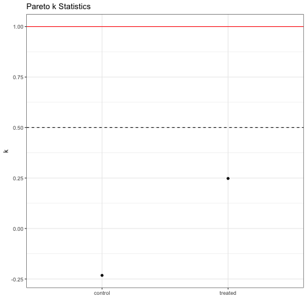
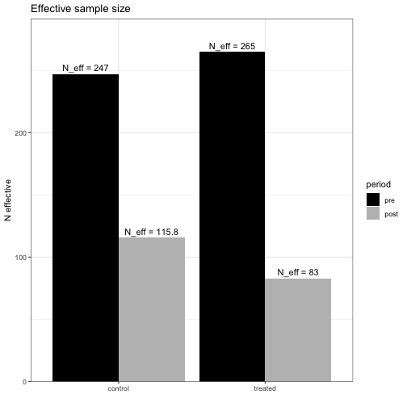
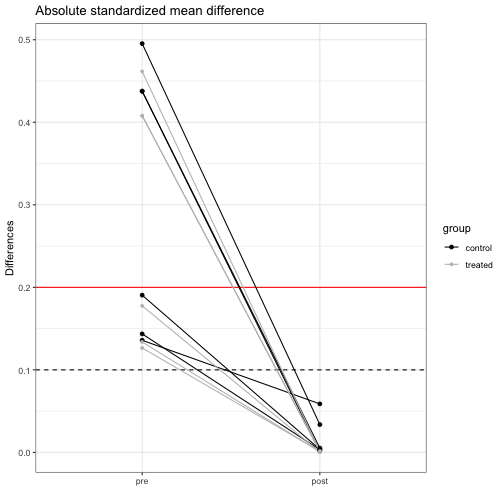

## Introduction
`causalOT` was developed to reproduce the methods in [*Optimal transport methods for causal inference*](https://arxiv.org/abs/2109.01991). The functions in the package are built to construct weights to make distributions more same and estimate causal effects. We recommend using the Causal Optimal Transport methods since they are semi- to non-parametric. This document will describe some simple usages of the functions in the package and should be enough to get users started.


## Estimating weights
The weights can be estimated by using the `calc_weight` function in the package. We select optimal hyperparameters through our bootstrap-based algorithm and target the average treatment effect.


```r
library(causalOT)
set.seed(1111)

hainmueller <- Hainmueller$new(n = 512)
hainmueller$gen_data()

x <- hainmueller$get_x()
z <- hainmueller$get_z()
y <- hainmueller$get_y()
weights <- calc_weight(x = x, z = z, method = "COT",
                       estimand = "ATE",
                       # default is torch's lbfgs where line search is important
                       options = list(line_search_fn = "strong_wolfe",
                       history_size = 10L, tol = 1e-3,
                       nboot = 1000L))
```
These weights will balance distributions, making estimates of treatment effects the same.

## Estimating treatment effects
We can then estimate effects with 

```r
tau_hat <- estimate_effect(causalWeights = weights,
                           y = y)
```
The estimator generated here is a simple weighted difference in observed outcomes between treatment groups.
This creates an object of class `causalEffect` which can be fed into the native `R` function `confint` to calculate asymptotic confidence intervals,

```r
ci_tau <- confint(object = tau_hat, level = 0.95)
```
or into `vcov` to calculate the variance of your estimate using the semiparametrically efficient variance formula:

```r
var_tau <- vcov(object = tau_hat)
```
This then gives the following treatment effect estimate, variance, and C.I.

```r
print(tau_hat@estimate)
#> [1] 0.09160276
print(var_tau)
#>           estimate
#> estimate 0.1470094
print(ci_tau)
#>               2.5 %    97.5 %
#> estimate -0.6598827 0.8430882
```
### Model based estimates
The function `estimate_effect` can also use models to estimate the treatment effects. There are also several additional arguments that will be demonstrated below. These are:

* `model.function`: either a character or function with the model you want to run
* `estimate.separately`: TRUE or FALSE. Should the model be estimated separately on each treatment group (TRUE) or jointly on the full data (FALSE)
* `augment.estimate`: Should an augmented estimator be used to calculate the final treatment effect? (TRUE or FALSE)
* `normalize.weights`: Should the weights be normalized to sum to one in each treatment group before being used. For methods except "Logistic", "Probit", or "CBPS", the weights are by definition normalized to sum to one so this option will not have an effect for most methods in the package.

The model functions we can use need to have a few components

1. Have a `formula` argument
2. Have a `data` argument that accepts a `data.frame`
3. Have a `weights` argument
4. Have a predict method that accepts a `newdata` argument.

One such function we could use is `lm`.

#### Linear models with `lm`


```r
tau_hat_lm <- estimate_effect(causalWeights = weights,
                           y = y,
                           model.function = lm,
                           estimate.separately = TRUE,
                           augment.estimate = FALSE,
                           normalize.weights = TRUE)
```
In this case, separate models will be fit to treated and controls and the predictions from the model will be used to estimate treatment effects. We can also calculate the augmented (aka doubly robust) estimate with argument `augment.estimate`.


```r
tau_hat_dr <- estimate_effect(causalWeights = weights,
                           y = y,
                           model.function = lm,
                           estimate.separately = TRUE,
                           augment.estimate = TRUE,
                           normalize.weights = TRUE)
```
We can also fit a weighted OLS by specifying `estimate.separately = FALSE`:

```r
tau_hat_wols <- estimate_effect(causalWeights = weights,
                           y = y,
                           model.function = lm,
                           estimate.separately = FALSE,
                           augment.estimate = FALSE,
                           normalize.weights = TRUE)
```
This fits a single weighted OLS model on the entire data.

#### Barycentric projections
An outcome model that is particular to this package is the function `barycentric_projection` that estimates, as the name implies, barycentric projections of the outcome data. To use this function, there are a couple of steps. Unlike the case for linear models with `lm`, we need to think carefully about what sample the data arise from.

To use this function outside of the main causalOT functions, we would do


```r
df <- data.frame(z = z, y = y, x)
bp <- barycentric_projection(formula = "y ~ x + z", 
        data = df,
        weights = weights,
        separate.samples.on = "z",
        penalty = 0.01,
        cost_function = NULL,
        p = 2,
        debias = FALSE,
        cost.online = "auto",
        diameter = NULL,
        niter = 1000,
        tol = 1e-7)
```
This will run the optimal transport problem between the samples denoted by "z" and get the dual potentials for the Sinkhorn Divergence problem.

Then, we can run a `predict` function to see what the outcomes would be if the samples had arisen from a different distribution. Let's say that everyone had actually been treated


```r

newdf   <- df
newdf$z <- 1L
preds   <- predict(object = bp, 
                   newdata = newdf,
                   source.sample = df$z)
head(preds)
#> [1] -2.80749441  0.52369862  6.65723020 -1.55036673 -0.07091995  1.55753697
```
The argument `source.sample` should be a vector that denotes the original treatment group of the samples. This allows the function to use the appropriate dual potentials to calculate the expected outcome.

In the context of the estimate_effect function, we need to supply some extra arguments in `...`.


```r
tau_hat_bp <- estimate_effect(causalWeights = weights,
                           y = y,
                           model.function = barycentric_projection,
                           estimate.separately = FALSE,
                           augment.estimate = TRUE,
                           normalize.weights = TRUE,
                      # special args for barycentric_projection
                           separate.samples.on = "z",
                           penalty = 0.01,
                           cost_function = NULL,
                           p = 3,
                           debias = FALSE,
                           cost.online = "tensorized",
                           diameter = NULL,
                           niter = 1000L,
                           tol = 1e-7,
                           line_search_fn = "strong_wolfe"
                           )
print(tau_hat_bp@estimate)
#> [1] -0.0003117836
```
This method currently doesn't have a variance estimator accounting for the weight uncertainty but we can use the asymptotic variance estimator of Hahn (1998):

```r
vcov(tau_hat_bp)
#>             estimate
#> estimate 0.007548076
vcov(tau_hat_wols)
#>            estimate
#> estimate 0.01194476
vcov(tau_hat)
#>           estimate
#> estimate 0.1470094
```

#### Note
In neither of these cases did we feed data or a formula to the model function. By default, the `estimate_effect` function will regress the outcome in argument `y` on all of the covariates from the `calc_weight` function and adjust for the treatment indicator as appropriate given the selected options. If you want to change the covariates for the outcome model from the weighting estimating function, you can provide new covariates in an argument `x`:

```r
estimate_effect(causalWeights = weights,
                           x = x_new,
                           y = y)
```
Note this data must have the same order as the previous data and must also be an object of class `matrix`.
  
## Diagnostics
Diagnostics are also an important part of deciding whether the weights perform well. There are several areas that we will explore:

1. Effective sample size
2. Mean balance
3. Distributional balance

#### 1. Effective sample size
Typically, estimated samples sizes with weights are calculated as $\sum_i 1/w_i^2$ and gives us a measure of how much information is in the sample. The lower the effective sample size (ESS), the higher the variance, and the lower the sample size, the more weight a few individuals have. Of course, we can calculate this in `causalOT`!

```r
ESS(weights)
#>  Control  Treated 
#> 156.6527 153.5573
```

Of course, this measure has problems because it can fail to diagnose problems with variable weights. In response, [Vehtari et al.](https://arxiv.org/abs/1507.02646) use Pareto smoothed importance sampling. We offer some shell code to adapt the class `causalWeights` to the `loo` package:

```r
raw_psis <- PSIS(weights)
```
This will also return the Pareto smoothed weights and log weights.

If we want to easily examine the PSIS diagnostics, we can pull those out too

```r
PSIS_diag(raw_psis)
#> $w0
#> $w0$pareto_k
#> [1] 0.3522737
#> 
#> $w0$n_eff
#> [1] 158.041
#> 
#> 
#> $w1
#> $w1$pareto_k
#> [1] 0.4149752
#> 
#> $w1$n_eff
#> [1] 158.3794
```
We can see that all of the $k$ values are below the recommended 0.5, indicating finite variance and that the central limit theorem holds. Note the estimated sample sizes are a bit lower than the `ESS` method above.

#### 2. Mean balance
Many authors consider the standardized absolute mean balance as a marker for important balance: see [Stuart (2010)](https://www.ncbi.nlm.nih.gov/pmc/articles/PMC2943670/). That is
$$ \frac{|\overline{X}_c - \overline{X}_t| }{\sigma_{\text{pool}}},$$ where
$\overline{X}_c$ is the mean in the controls, $\overline{X}_t$ is the mean in the treated, and $\sigma_{\text{pool}}$ is the pooled standard deviation.
We offer such checks in `causalOT` as well.

First, we consider pre-weighting mean balance

```r
mean_balance(x = hainmueller)
#>        X1        X2        X3        X4        X5        X6 
#> 1.0889178 0.9320099 0.9322327 0.3741322 0.2798986 0.2644929
```
and after weighting mean balance

```r
mean_balance(x = hainmueller, weights = weights)
#>          X1          X2          X3          X4          X5          X6 
#> 0.010963842 0.023804742 0.027403037 0.005396086 0.015731870 0.155767759
```
Pretty good!

However, mean balance doesn't ensure distributional balance.

#### 3. Distributional balance
Ultimately, distributional balance is what we care about in causal inference. Fortunately, we can also measure that too. We consider the 2-Sinkhorn divergence of [Genevay et al.](http://proceedings.mlr.press/v84/genevay18a/genevay18a.pdf) since it metrizes the convergence in distribution.

Before weighting, distributional balance looks poor:

```r
# controls
ot_distance(x1 = hainmueller$get_x0(), x2 = hainmueller$get_x(),
              a = NULL, b = rep(1/512,512),
              p = 2, penalty = 1e3, debias = TRUE)
#> [1] 0.5311378
#treated
ot_distance(x1 = hainmueller$get_x1(), x2 = hainmueller$get_x(),
              a = NULL, b = rep(1/512,512),
              p = 2, penalty = 1e3, debias = TRUE)
#> [1] 0.4612781
```

But after weighting, it looks much better!

```r
# controls
ot_distance(x1 = hainmueller$get_x0(), x2 = hainmueller$get_x(),
              a = weights@w0, b = rep(1/512,512),
              p = 2, penalty = 1e3, debias = TRUE)
#> [1] 0.003544579
# treated
ot_distance(x1 = hainmueller$get_x1(), x2 = hainmueller$get_x(),
              a = weights@w1, b = rep(1/512,512),
              p = 2, penalty = 1e3, debias = TRUE)
#> [1] 0.001587887
```
After Causal Optimal Transport, the distributions are *much* more similar.
We can also simply feed the output of calc_weight directly into the `ot_distance` function:

```r
ot_distance(x1 = weights, p = 2, penalty = 1e3, debias = TRUE)
#> $pre
#>   control   treated 
#> 0.5311378 0.4612781 
#> 
#> $post
#>     control     treated 
#> 0.003544579 0.001587887
```
and the S4 deployment takes care of the rest.

Finally, we can construct a summary of the optimal transport distances, Pareto k statistics, effective sample size, and mean balance using the summary method:


```r
summarized_cw <- summary(weights, penalty = 1000)
```
We can then print the object to the screen:

```r
summarized_cw
#> Diagnostics for causalWeights for estimand ATE
#> Control group
#>                                pre         post
#> OT distance              0.5311378 3.544579e-03
#> Pareto k                        NA 3.522737e-01
#> N eff                  247.0000000 1.580410e+02
#> Avg. std. mean balance   0.3067516 3.380779e-02
#> 
#> Treated group
#>                                pre         post
#> OT distance              0.4612781 1.587887e-03
#> Pareto k                        NA 4.149752e-01
#> N eff                  265.0000000 1.583794e+02
#> Avg. std. mean balance   0.2859156 1.753215e-02
```
or we can make some diagnostic plots too!

```r
plot(summarized_cw)
#> Plotting diagnostics for causalWeights for estimand ATE
```



## Other methods
The calc weight function can also handle other methods. We have implemented methods for logistic or probit regression, the covariate balancing propensity score (CBPS), stable balancing weights (SBW), entropy balancing weights (EntropyBW), and the synthetic control method (SCM).

```r
calc_weight(x = hainmueller, method = "Logistic",
                       estimand = "ATE")

calc_weight(x = hainmueller, method = "Probit",
                       estimand = "ATE")

calc_weight(x = hainmueller, method = "CBPS",
                       estimand = "ATE")

calc_weight(x = hainmueller, method = "SBW")

calc_weight(x = hainmueller, method = "EntropyBW")

calc_weight(x = hainmueller, method = "SCM")
```

The function also accepts methods "EnergyBW", for Energy Balancing Weights of Hainmueller and Mak (2020), and "NNM", for nearest neighbor matching with replacement, but these are special cases of COT with the penalty parameter $\lambda$ forced to be $\infty$ and $0$, respectively.


## Further information

### Options?
The argument `options` is a little vague. So we also have a function `cotOptions` which is avaible to help. The documentation provides more details. The other optimization methods "SBW", "EntropyBW", and "SCM" provide their own options function. The options for "Logistic" and "Probit" pass arguments to `glm` and "CBPS" will pass arguments to the `CBPS` function in the package of the same name.

### Data
I remember when I was first starting `R`, I had a hard time knowing how to turn data.frames into matrices in an easy way. Also, maybe you don't want to go through the effort of doing this transformation yourself. In response, I created the `df2dataHolder()` function to do the work for you. It then returns a `dataHolder` object used internally by `causalOT`. All you need to provide are formula for the treatment and outcome and any sample weights you have.


```r
df <- data.frame(z = z, y = y, x)
df2dataHolder(treatment.formula = "z ~ x", 
     outcome.formula = "y ~ x + z",
     data = df,
     weights = NA_real_)
#> Formal class 'dataHolder' [package "causalOT"] with 6 slots
#>   ..@ x      : num [1:512, 1:6] -0.122 1.87 0.905 1.661 0.164 ...
#>   .. ..- attr(*, "dimnames")=List of 2
#>   .. .. ..$ : chr [1:512] "1" "2" "3" "4" ...
#>   .. .. ..$ : chr [1:6] "xX1" "xX2" "xX3" "xX4" ...
#>   .. ..- attr(*, "assign")= int [1:6] 1 1 1 1 1 1
#>   ..@ z      : int [1:512] 1 1 0 1 0 0 1 1 1 0 ...
#>   ..@ y      : Named num [1:512] -2.8075 0.5237 6.194 -1.5504 0.0248 ...
#>   .. ..- attr(*, "names")= chr [1:512] "1" "2" "3" "4" ...
#>   ..@ n0     : int 247
#>   ..@ n1     : int 265
#>   ..@ weights: num [1:512] 0.00195 0.00195 0.00195 0.00195 0.00195 ...
```
This can be passed to the `calc_weight` function directly in the argument `x`.


